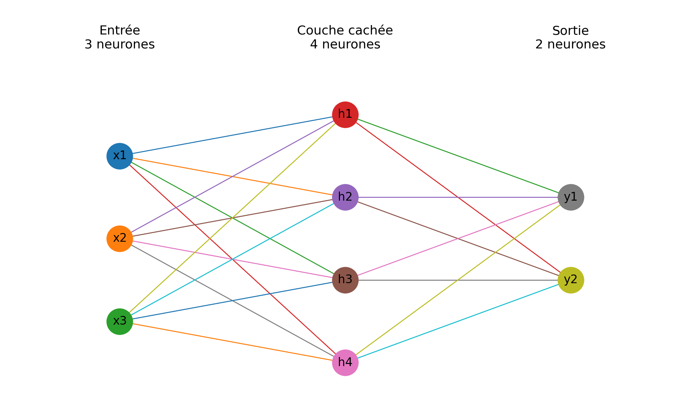
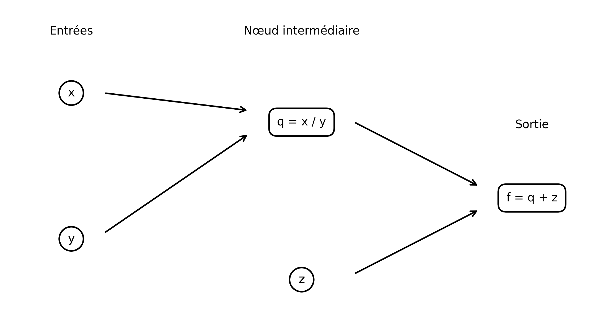

# TP1 — SLURM et environnement de travail

## 1. Utilisation de SLURM

### GPU alloué

Lors de l'allocation interactive d'un nœud GPU avec SLURM, le GPU mis à disposition était un **NVIDIA L4**.

### Annulation du job interactif

Le job interactif avait l'identifiant **2015**.

Il a été annulé avec la commande :

```bash
scancel 2015
```

La commande suivante permet ensuite de vérifier qu'il n'apparaît plus dans la file d'attente :

```bash
squeue -u $USER
```

### Job batch `hello.sh`

Le script `hello.sh` utilisé pour soumettre un job batch est :

```bash
#!/bin/bash
#SBATCH --partition=gpu
#SBATCH -t 01:00:00
#SBATCH --gres=gpu:1
#SBATCH --cpus-per-task=1
#SBATCH --mem=8G
#SBATCH -J hello-slurm
#SBATCH -o logs/%x-%j.out
#SBATCH -e logs/%x-%j.err

hostname
nvidia-smi
```

Le job a été soumis avec :

```bash
sbatch scripts/hello.sh
```

Le job obtenu avait l'identifiant **2059**.

Après son exécution, son état a été vérifié avec `sacct`. Le job était dans l'état :

```text
COMPLETED
```

Cela signifie que son exécution s'est terminée correctement.

### Informations sur l'utilisation des ressources

La commande `sacct` permet d'obtenir des informations sur les ressources demandées et réellement utilisées par un job.

Deux informations importantes sont notamment :

- `ReqMem` : quantité de mémoire demandée lors de la soumission du job ;
- `MaxRSS` : quantité maximale de mémoire physique réellement utilisée par le processus.

Dans notre cas, la mémoire demandée dans le script était :

```bash
#SBATCH --mem=8G
```

soit **8 Go de mémoire**.

`ReqMem` représente donc la réservation effectuée auprès de SLURM, tandis que `MaxRSS` permet d'observer la consommation réelle maximale du programme. Cette comparaison permet d'adapter les futures demandes de ressources et d'éviter de réserver inutilement trop de mémoire.

## 2. Création d'un environnement virtuel Python

### Installation de Miniforge

Miniforge a été installé dans le répertoire :

```text
/mnt/hdd/homes/iabid/miniforge3
```

Le gestionnaire de paquets `mamba` est disponible dans cette installation.

La version utilisée est :

```text
mamba 2.9.0
```

### Création de l'environnement

Un environnement virtuel nommé `deeplearning` a été créé pour le TP.

Il utilise :

```text
Python 3.10.21
```

L'environnement peut être activé avec :

```bash
source /mnt/hdd/homes/iabid/miniforge3/etc/profile.d/conda.sh
conda activate deeplearning
```

L'utilisation d'un environnement virtuel permet d'isoler les dépendances nécessaires au projet et d'éviter les conflits avec les autres installations Python disponibles sur le système.

### Installation de PyTorch avec CUDA

PyTorch a été installé avec les bibliothèques nécessaires à l'utilisation du GPU :

```bash
python -m pip install --default-timeout=120 torch torchvision torchaudio --index-url https://download.pytorch.org/whl/cu121
```

Les versions installées sont :

```text
PyTorch      2.5.1+cu121
torchvision  0.20.1+cu121
torchaudio   2.5.1+cu121
```

Ces versions utilisent les bibliothèques CUDA 12.1 fournies avec les wheels PyTorch.

### Vérification du GPU

Un script `check_gpu.py` a été utilisé afin de vérifier que PyTorch détecte correctement le GPU.

Le test a confirmé que CUDA est disponible :

```text
CUDA available: True
```

Le GPU détecté est :

```text
NVIDIA L4
```

PyTorch est donc capable d'effectuer les calculs sur le GPU alloué par SLURM.

### Reproductibilité de l'environnement

Un fichier `environment.yml` a été créé afin de décrire l'environnement Python utilisé pour le TP.

Ce fichier permet de conserver les informations nécessaires à la reconstruction de l'environnement et facilite ainsi la reproductibilité des expériences.

### TensorBoard

TensorBoard a également été installé dans l'environnement.

La version utilisée est :

```text
TensorBoard 2.20.0
```

La version de `setuptools` a été maintenue sous la version 81 afin d'assurer la compatibilité avec les dépendances utilisées :

```text
setuptools 80.10.2
```

## 3. Exercices théoriques

### Architecture et paramètres

#### Architecture du MLP

On considère un perceptron multicouche composé de :

- **3 neurones d'entrée** ;
- **4 neurones dans la couche cachée** ;
- **2 neurones de sortie**.

Le schéma correspondant est :



Chaque neurone d'une couche est connecté à tous les neurones de la couche suivante.

**Nombre de paramètres sans les biais :**

Pour la première couche :

`3 × 4 = 12`

Pour la deuxième couche :

`4 × 2 = 8`

Donc :

`12 + 8 = 20`

paramètres sans les biais.

**Nombre de paramètres avec les biais :**

La couche cachée possède 4 biais et la couche de sortie possède 2 biais.

Le nombre total de paramètres est donc :

`20 + 4 + 2 = 26`

Ainsi, le modèle possède **20 paramètres sans biais** et **26 paramètres avec biais**.

### Équations et dimensions

Pour un batch de taille N, l'entrée X a pour dimension `(N, 3)`.

Le forward pass est :

`H = ReLU(X × W₁ᵀ + b₁)`

puis :

`Y = H × W₂ᵀ + b₂`

Les dimensions sont :

| Élément | Dimension |
|---|---|
| `X` | `(N, 3)` |
| `W₁` | `(4, 3)` |
| `b₁` | `(1, 4)` → diffusé en `(N, 4)` |
| `H` | `(N, 4)` |
| `W₂` | `(2, 4)` |
| `b₂` | `(1, 2)` → diffusé en `(N, 2)` |
| `Y` | `(N, 2)` |

En effet :

`(N, 3) × (3, 4) = (N, 4)`

puis :

`(N, 4) × (4, 2) = (N, 2)`

### Graphe de calcul et rétropropagation

#### Graphe de calcul

On considère la fonction :

`f(x, y, z) = x / y + z`

On introduit le nœud intermédiaire :

`q = x / y`

Le graphe de calcul est :



#### Forward pass

Avec :

`x = 2, y = 4, z = 0`

On calcule d'abord :

`q = x / y = 2 / 4 = 0.5`

Puis :

`f = q + z = 0.5 + 0 = 0.5`

La valeur de la fonction est donc **f = 0.5**.

#### Backpropagation

On commence par :

`f = q + z`

Donc :

`∂f/∂q = 1`

et :

`∂f/∂z = 1`

Pour :

`q = x / y`

on a :

`∂q/∂x = 1 / y`

et :

`∂q/∂y = -x / y²`

Par la règle de la chaîne :

`∂f/∂x = (∂f/∂q) × (∂q/∂x)`

Donc, au point `(2, 4, 0)` :

`∂f/∂x = 1 × (1 / 4) = 0.25`

Pour y :

`∂f/∂y = (∂f/∂q) × (∂q/∂y)`

Donc :

`∂f/∂y = 1 × (-2 / 4²) = -2 / 16 = -0.125`

Enfin :

`∂f/∂z = 1`

Les gradients sont donc :

- `∂f/∂x = 0.25`
- `∂f/∂y = -0.125`
- `∂f/∂z = 1`

### Mise à jour des poids

On utilise une descente de gradient avec un taux d'apprentissage :

`η = 1`

La règle de mise à jour est :

`x′ = x - η × ∂f/∂x`

`y′ = y - η × ∂f/∂y`

`z′ = z - η × ∂f/∂z`

Pour x :

`x′ = 2 - 1 × 0.25 = 1.75`

Pour y :

`y′ = 4 - 1 × (-0.125) = 4.125`

Pour z :

`z′ = 0 - 1 × 1 = -1`

On obtient donc :

`x′ = 1.75, y′ = 4.125, z′ = -1`

La nouvelle valeur de la fonction est :

`f′ = x′ / y′ + z′`

`f′ = 1.75 / 4.125 - 1`

`f′ ≈ 0.4242 - 1`

`f′ ≈ -0.5758`

La valeur initiale était **f = 0.5**.

Après la mise à jour, on obtient **f′ ≈ -0.5758**.

On constate donc que :

`-0.5758 < 0.5`

La valeur de la fonction a bien **diminué**, comme attendu avec cette étape de descente de gradient.

## Questions de réflexion

### Pourquoi utilisons-nous la règle de la chaîne ?

La règle de la chaîne permet de calculer le gradient d'une fonction composée de nombreuses opérations successives. Dans un réseau profond, elle permet de propager l'erreur depuis la sortie vers les couches précédentes afin de calculer le gradient de chaque paramètre.

### Pourquoi utiliser des mini-batchs ?

Les mini-batchs offrent un compromis entre le coût de calcul d'un seul exemple et celui de l'ensemble des données. Ils permettent d'exploiter efficacement les calculs parallèles tout en fournissant des estimations fréquentes du gradient pour mettre à jour les paramètres.

## Association des fonctions de sortie et des fonctions de perte

| Tâche | Fonction finale (sortie) | Fonction de perte |
|---|---|---|
| Classification binaire | **Sigmoïde** | **Binary Cross-Entropy (BCE)** |
| Classification multi-classe | **Softmax** | **Cross-Entropy** |
| Régression pure | **Identité (aucune)** | **MSE (Mean Squared Error)** |

Ainsi :

1. Classification binaire → **Sigmoïde + Binary Cross-Entropy**
2. Classification multi-classe → **Softmax + Cross-Entropy**
3. Régression pure → **Identité + MSE**

# Premier réseau de neurones avec PyTorch

## Préparation des données

Le jeu de données CIFAR-10 est chargé avec une taille de mini-batch de 32.

### Rôle de `batch_size` et `shuffle`

L'argument `batch_size` définit le nombre d'exemples traités simultanément avant le calcul d'une mise à jour des paramètres. Ici, chaque mini-batch contient 32 images.

L'argument `shuffle` détermine si les données sont mélangées avant chaque époque. Pour l'entraînement, `shuffle=True` permet de présenter les exemples dans un ordre différent à chaque époque et évite que le modèle ne dépende de l'ordre des données.

Pour l'ensemble de test, `shuffle=False` est utilisé car aucun apprentissage n'est effectué. Il n'est donc pas nécessaire de modifier l'ordre des exemples pour calculer les performances du modèle.

## Implémentation du MLP

Le réseau utilisé possède une couche d'entrée correspondant aux images CIFAR-10 de taille `32 × 32 × 3`, une couche cachée de 128 neurones avec une activation ReLU, et une couche de sortie de 10 neurones correspondant aux 10 classes.

### Utilisation de `torch.flatten(x, 1)`

Les images reçues par le réseau ont plusieurs dimensions : la dimension du batch, les trois canaux RGB, la hauteur et la largeur. Une couche linéaire attend cependant un vecteur de caractéristiques pour chaque exemple.

`torch.flatten(x, 1)` transforme donc chaque image de taille `3 × 32 × 32` en un vecteur de **3072 valeurs**, tout en conservant la dimension du batch.

### Pourquoi ne pas appliquer Softmax ?

La dernière couche du réseau retourne directement les logits, sans appliquer Softmax.

`nn.CrossEntropyLoss` attend directement ces logits et réalise en interne les opérations nécessaires au calcul de la Cross-Entropy. Ajouter un Softmax avant cette fonction de perte serait donc inutile et pourrait réduire la stabilité numérique du calcul.

## Entraînement du modèle

Le modèle a été entraîné pendant **10 époques** avec l'optimiseur SGD, un taux d'apprentissage de `0.01` et un momentum de `0.9`.

L'entraînement a été exécuté via SLURM sur un GPU **NVIDIA L4**.

Les résultats obtenus sont :

| Époque | Loss | Accuracy |
|---:|---:|---:|
| 1 | 2.0883 | 0.3304 |
| 2 | 2.1281 | 0.3560 |
| 3 | 2.1288 | 0.3650 |
| 4 | 2.0725 | 0.3836 |
| 5 | 2.0766 | 0.3862 |
| 6 | 2.0587 | 0.3939 |
| 7 | 2.0087 | 0.4081 |
| 8 | 2.0123 | 0.4098 |
| 9 | 1.9616 | 0.4203 |
| 10 | 1.9358 | 0.4262 |

À la dernière époque, l'accuracy d'entraînement atteint donc environ **42.62 %**.

### Différence entre `optimizer.zero_grad()` et `loss.backward()`

`optimizer.zero_grad()` réinitialise les gradients des paramètres du modèle. Cette étape est nécessaire car PyTorch accumule les gradients par défaut.

`loss.backward()` effectue la rétropropagation à partir de la fonction de perte et calcule les gradients de la perte par rapport aux paramètres du réseau.

Ainsi, `zero_grad()` efface les gradients précédents tandis que `backward()` calcule les nouveaux gradients.

## Évaluation sur l'ensemble de test

Après l'entraînement, le modèle a été évalué sur l'ensemble de test CIFAR-10.

La précision obtenue est :

**Test accuracy = 0.389 = 38.9 %**

### Utilisation de `torch.no_grad()`

Lors de l'évaluation, aucune mise à jour des paramètres n'est effectuée. Le bloc `with torch.no_grad():` désactive donc le calcul et le stockage des gradients.

Cela réduit l'utilisation de la mémoire, notamment la mémoire GPU, et diminue le coût de calcul pendant l'inférence.

### Précision d'un classificateur aléatoire

CIFAR-10 contient 10 classes. Un classificateur choisissant uniformément une classe de manière aléatoire aurait donc une précision moyenne d'environ :

`1 / 10 = 0.1 = 10 %`

La précision obtenue par notre modèle, **38.9 %**, est donc nettement supérieure à celle d'un classificateur aléatoire.

## Sauvegarde du modèle

Après l'évaluation, les paramètres entraînés du réseau ont été sauvegardés dans le fichier `mlp_model.pth` avec :

```python
torch.save(model.state_dict(), "mlp_model.pth")
```

Le fichier généré sur le cluster a une taille d'environ **1.5 Mo**.
