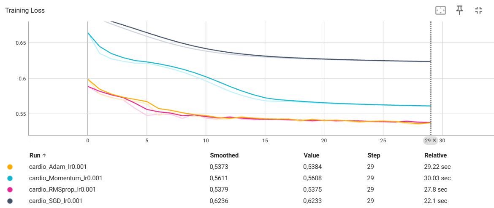

# TP2 — Régularisation, optimisation et métriques

## 1. Création d'un dataset personnalisé

Le dataset utilisé est le *Cardiovascular Disease Dataset*. Après suppression des doublons et de la colonne `id`, les variables catégorielles `gender`, `cholesterol` et `gluc` sont encodées par one-hot encoding. Les features sont ensuite normalisées avec `StandardScaler`.

Le dataset obtenu contient **70 000 exemples** et **16 features**. Pour un batch de taille 64, les dimensions obtenues sont :

- Features : `torch.Size([64, 16])`
- Labels : `torch.Size([64, 1])`

Le dataset est séparé en trois parties : 80 % pour l'entraînement, 10 % pour la validation et 10 % pour le test.

### Data leakage avec StandardScaler

Dans le code fourni, `StandardScaler` est ajusté sur l'ensemble du dataset avant d'effectuer la séparation entre entraînement, validation et test. Il calcule donc la moyenne et l'écart-type en utilisant également les données de validation et de test.

Cela constitue une fuite de données (*data leakage*), car des informations provenant des ensembles de validation et de test influencent indirectement le prétraitement des données d'entraînement. L'évaluation peut alors être légèrement biaisée et ne représente plus complètement la capacité du modèle à généraliser sur des données réellement inconnues.

Une pratique correcte consiste à ajuster (`fit`) le scaler uniquement sur l'ensemble d'entraînement, puis à appliquer (`transform`) les mêmes paramètres aux ensembles d'entraînement, de validation et de test.

### Dataset trop volumineux pour la RAM

Si le dataset était trop volumineux pour tenir en mémoire, par exemple 500 Go, on pourrait utiliser `torch.utils.data.IterableDataset`.

Contrairement à un `Dataset` classique qui permet généralement d'accéder aux exemples par indice, un `IterableDataset` permet de lire et de produire les données progressivement, par exemple depuis des fichiers ou un flux, sans avoir à charger l'intégralité du dataset en mémoire.

## 2. MLP et régularisation L1 / L2

Le modèle utilisé est un MLP composé de deux couches cachées de 128 neurones avec des activations ReLU. La couche de sortie contient un neurone avec une activation Sigmoid pour effectuer la classification binaire.

### Effet d'une régularisation L1 trop forte

Une première exécution avec `l1_lambda = 1e-4` et `l2_lambda = 1e-3` a servi de référence. La loss diminue de 0.8519 à 0.7367 en 10 époques, tandis que l'accuracy d'entraînement passe de 61.23 % à 67.51 %.

Le TP demande ensuite de fixer :

- `l1_lambda = 0.1`
- `l2_lambda = 0`

Les résultats obtenus sont très différents. La loss atteint 6.7243 à la première époque, puis reste bloquée autour de 1.6340. L'accuracy reste quant à elle proche de 50 % pendant tout l'entraînement et termine à 50.36 %.

La régularisation L1 est ici beaucoup trop forte. La pénalité appliquée aux poids domine l'optimisation et pousse fortement les paramètres du réseau vers zéro. Le modèle perd alors une grande partie de sa capacité à représenter les relations présentes dans les données et n'arrive plus à apprendre correctement.

Ce phénomène correspond à du **sous-apprentissage (underfitting)** : le modèle est trop contraint pour ajuster correctement les données d'entraînement.

### Régularisation L2 avec l'optimiseur PyTorch

Il n'est généralement pas nécessaire d'ajouter manuellement la pénalité L2 à la fonction de coût. Les optimiseurs PyTorch, comme `optim.SGD`, proposent l'argument `weight_decay`.

Par exemple :

`optim.SGD(model.parameters(), lr=0.01, weight_decay=1e-3)`

Cet argument permet d'appliquer directement une pénalisation de type L2 lors de l'optimisation.

### Différence entre L1 et L2

La régularisation **L1** pénalise la somme des valeurs absolues des poids. Elle favorise des poids exactement nuls ou très proches de zéro et peut donc produire des modèles plus parcimonieux (*sparse*).

La régularisation **L2** pénalise la somme des carrés des poids. Elle tend plutôt à réduire progressivement l'amplitude de l'ensemble des poids sans nécessairement les rendre exactement nuls.

Ainsi, L1 favorise davantage la parcimonie des paramètres, tandis que L2 répartit généralement la pénalisation de manière plus progressive sur l'ensemble des poids.

## 3. Comparaison des optimiseurs avec TensorBoard

Les optimiseurs SGD, Momentum, RMSprop et Adam ont été comparés avec le même learning rate `0.001` pendant 30 époques. La loss d'entraînement moyenne de chaque époque a été enregistrée avec TensorBoard.

### Comparaison de la convergence

Les quatre optimiseurs présentent des comportements de convergence différents. Dès la première époque, les losses obtenues sont :

- SGD : 0.6898
- Momentum : 0.6641
- RMSprop : 0.5887
- Adam : 0.5987

RMSprop présente donc la convergence initiale la plus rapide dans cette expérience, suivi de près par Adam. Ces deux optimiseurs atteignent rapidement une loss proche de 0.55, alors que SGD et Momentum convergent plus progressivement.

Après 30 époques, les losses obtenues sont :

- SGD : 0.6233
- Momentum : 0.5608
- RMSprop : 0.5375
- Adam : 0.5384

RMSprop et Adam obtiennent ainsi des résultats très proches à la fin de l'entraînement.

### SGD et Momentum

Momentum converge nettement plus rapidement que SGD. À la fin des 30 époques, la loss de Momentum atteint 0.5608 contre 0.6233 pour SGD.

Avec SGD classique, la mise à jour des paramètres dépend uniquement du gradient courant. Momentum conserve également une information provenant des mises à jour précédentes. Cela permet d'accumuler de la vitesse dans les directions cohérentes du gradient et d'accélérer la progression de l'optimisation.

Dans cette expérience, cet effet est clairement visible sur les courbes : Momentum descend plus rapidement et atteint une loss plus faible que SGD pour le même learning rate.

## 4. Métriques d'évaluation

Le modèle retenu est évalué sur l'ensemble de test. Les résultats obtenus sont :

- Precision : 0.7637
- Recall : 0.6888
- F1-score : 0.7243
- ROC AUC : 0.8019

### Precision et Recall

La **precision** mesure, parmi les exemples prédits positifs par le modèle, la proportion qui est réellement positive. Une precision élevée signifie donc que le modèle génère peu de faux positifs.

Le **recall** mesure, parmi tous les exemples réellement positifs, la proportion correctement détectée par le modèle. Un recall élevé signifie donc que le modèle génère peu de faux négatifs.

Dans notre expérience, la precision de 0.7637 est supérieure au recall de 0.6888. Le modèle est donc plus performant pour éviter les faux positifs que pour détecter l'ensemble des cas positifs.

### Quelle métrique privilégier dans un contexte médical ?

Dans un contexte de détection d'une maladie, on privilégie généralement le **recall**. Un faux négatif correspond à une personne malade que le modèle classe comme non malade, ce qui peut conduire à ne pas détecter la maladie et à retarder une prise en charge.

Il peut donc être préférable d'accepter davantage de faux positifs, qui pourront ensuite être vérifiés par des examens complémentaires, afin de réduire le nombre de personnes malades non détectées.

Le choix dépend néanmoins du contexte médical et du coût relatif des faux positifs et des faux négatifs.

### Rôle de l'AUC

La precision, le recall et le F1-score calculés ici dépendent du seuil de classification choisi, qui est fixé à `0.5`.

La **ROC AUC** évalue au contraire la capacité du modèle à distinguer les deux classes sur l'ensemble des seuils de décision possibles. Elle permet donc d'évaluer le pouvoir discriminant global du modèle sans se limiter au seuil de 0.5.

Dans notre expérience, le modèle obtient une ROC AUC de **0.8019**, ce qui indique qu'il possède une capacité de discrimination entre les deux classes, indépendamment du choix d'un seuil particulier.
